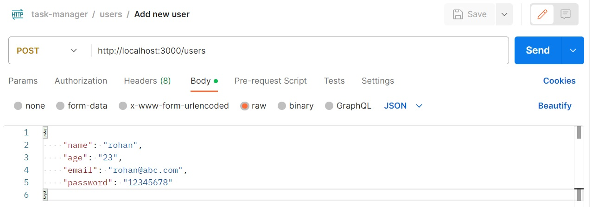

# Task Manager

This node app provide REST APIs to perform CRUD operations on users and tasks collection in mongodb.

## Main topics

Following Node/JS topics are are the main focus in this console app - 

- REST APIs
- CRUD operations on mongodb
- Promises and promise chaining
- Async/ await

## Node/JS Topics covered

Following Node/JS topics are covered in this console app - 

- Importing files/npm modules
- CLI handling
- Error handling
- Http request, response and error handling
- Callback functions and chaining
- Express

## Features
Following features are available in this node app - 

### 1. Add new user to users collection
You can add a new user to users collection using the following post request - 

### 2. Get all users
You can get all users from users collection using the following post request - 
